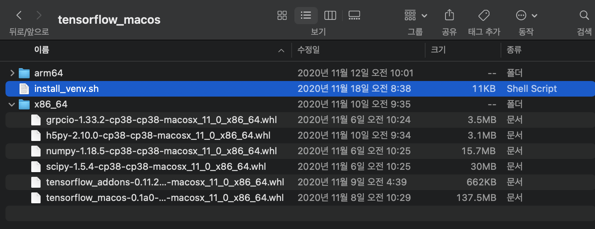

# M1 Tensorflow 설치 가이드


>**MAC 터미널 사용**
> 

## 1. intel 칩셋인 것 처럼 가상환경을 강제로 세팅하는 방식
> Anaconda 환경, M1(arm64) 칩셋 에서 마치 intel 칩셋 에서 텐서플로우를 설치하는 것처럼 강제하는 방식
> 
> 일부분의 라이브러리만 설치가능한 단점이 있음 (판다스 불가)


### 1) 텐서플로우 설치 코드 다운로드
> https://github.com/apple/tensorflow_macos/releases/download/v0.1alpha0/tensorflow_macos-0.1alpha0.tar.gz


### 2) 해당 파일 압축 풀기


우리가 쓸 파일은 x86_64  (인텔 칩셋 환경의 텐서플로우 whl 파일)

### 3) 아나콘다 가상한경 새로 생성
- 가상환경 생성 
```angular2html
conda create --name tf_m1 python=3.6.8 
conda env list
```


- 가상환경 실행
```angular2html
conda activate tf_m1
pip freeze
```
### 4) 아까 다운로드 받은 tensorflow_macos 안에 x86_64 폴더에서 파일명들 바꾸기
> 숫자를 바꾸기: 00000-macosx_11_0_x86_64.whl  -> 00000-macosx_10_16_x86_64.whl
> 
>Example: tensorflow_macos-0.1a0-cp38-cp38-macosx_10_16_x86_64.whl
> 

### 5) 가상환경(conda activate) 상태에서 아래 명령어 들 중 username을 변경하여 터미널에서 실행하기
```angular2html
pip install pip wheel setuptools cached-property six
pip install "/Users/username/Downloads/tensorflow_macos/x86_64/grpcio-1.33.2-cp38-cp38-macosx_10_16_x86_64.whl"
pip install "/Users/username/Downloads/tensorflow_macos/x86_64/h5py-2.10.0-cp38-cp38-macosx_10_16_x86_64.whl"
pip install "/Users/username/Downloads/tensorflow_macos/x86_64/numpy-1.18.5-cp38-cp38-macosx_10_16_x86_64.whl"
pip install "/Users/username/Downloads/tensorflow_macos/x86_64/scipy-1.5.4-cp38-cp38-macosx_10_16_x86_64.whl"
pip install "/Users/username/Downloads/tensorflow_macos/x86_64/tensorflow_addons-0.11.2+mlcompute-cp38-cp38-macosx_10_16_x86_64.whl"
pip install absl-py astunparse flatbuffers gast google_pasta keras_preprocessing opt_einsum protobuf tensorflow_estimator termcolor typing_extensions wrapt wheel tensorboard typeguard
pip install "/Users/username/Downloads/tensorflow_macos/x86_64/tensorflow_macos-0.1a0-cp38-cp38-macosx_10_16_x86_64.whl"
```

### 6) 파이썬 실행 한뒤 import tensorflow as tf 가 되는 지 확인 하기


### 7) 만약 주피터 노트북을 사용하고 싶다면 해당 콘다 환경을 등록해야함
- 주피터 노트북에 가상환경 등록
```angular2html
pip install ipykernel
python -m ipykernel install --user --name tf_m1 --display-name "tf_m1"
```


> 
>> 참고 https://github.com/apple/tensorflow_macos/issues/48
> 

## 2. M1(arm64)용 miniconda 가상환경을 설치한 뒤 강제로 tensorflow를 설치하는 방식 (pending)

**테스트 결과 설치가 안된다는 이슈가 있음**