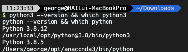

# MAC 가상환경 세팅 및 패키지 설치
>|date|name| github
>|-----|----|----|
>|`2021.12.29` |`연세대학교 디지털애널리티스 석사 3학기 용지호` |[@`Hail-cali`](https://github.com/Hail-cali)|

----

>**MAC 터미널 사용**
## 1. 파이썬 버전 확인
```angular2html
python3 --version && which python3
python --version && which python
```


-----
 ## 2. 가상 환경 확인

- ### **conda**
```angular2html
conda info
```


- conda 인식 못할 때 bash profile 에 conda path 입력 필요
```angular2html
cd ~/opt/anaconda3/bin
pwd
## export PATH="path:$PATH"
source ~/.bash_profile
```

- ### **venv**

```angular2html
cd /usr/local/opt && ls | grep python*
```


----

## 3. 가상환경 생성
>- conda 의 경우 python 버전 3.6.8
>- venv 의 경우 크게 상관 없음

- ### **conda**
- 가상환경 생성 
```angular2html
conda create --name tf_nlp python=3.6.8 
conda env list
```


- 가상환경 실행
```angular2html
conda activate tf_nlp
pip freeze
```
- 주피터 노트북에 가상환경 등록
```angular2html
pip install ipykernel
python -m ipykernel install --user --name tf_nlp --display-name "tf_nlp"
```


- 만든 가상환경 삭제하고 싶을 때
```angular2html
conda remove --name tf_nlp --all
```

- ### **venv**
- 가상환경 생성
```angular2html
mkdir my_tf && cd my_tf
python -m venv .venv

```
- 가상환경 실행
```angular2html
source .venv/bin/activate
pip freeze
```
- 가상환경 종료
```angular2html
deactivate
```

## 4. JAVA 버전 확인 및 설치

- 현재 잡혀있는 java 버전과 path 확인
```angular2html
which java && java --version
```


- brew로 자바 설치하기
```angular2html
brew update
brew tap adoptopenjdk/openjdk
brew search jdk
```


- java openjdk 15 설치
```angular2html
brew install --cask adoptopenjdk15
```


- 컴퓨터에 설치된 java 버전들 확인
```angular2html
/usr/libexec/java_home -V
```


- java 버전 바꾸기
```angular2html
echo $SHELL
```

- shell 이 zsh 일경우 ~/.zshrc    bash 일 경우 ~/.bash_profile
```angular2html
vim ~/.zshrc
```
- i 를 눌러 아래 문자 입력 후 esc 키보드 버튼 클릭, :wq 입력 (command-z 쓰지 말기, 이동은 방향키로) 
>>export JAVA_HOME_11=$(/usr/libexec/java_home -v15)
>>export JAVA_HOME=$JAVA_HOME_15


## 5. 패키지 설치
> **본인이 사용하는 가상환경 실행한 뒤 해당 pip install 하기**
> **패키지 설치는 `하나의 패키지 관리 툴 만` 사용**, 
> 예를들어 conda install 과 pip install 둘다 사용하여 패키지 설치 하지 않기
> 
>> 쉽게 설명하면 개발자가 직접 각 패키지 관리 툴(pip, apt-get, conda etc..)에 링크를 올리는 방식
> 
>> 즉 패키지 관리 도구 마다 버전이나 코드가 미세하게 다를 수 있어 conflict error 나 dependency error 야기할 수  있음
>
> > 또한 tensorflow 같은 큰 패키지는 Numpy 등 다양한 서브 패키지들을 포함하고 있음
> 
```angular2html
pip install tensorflow && pip install konlpy && pip install tweepy==3.10

```